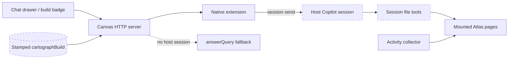
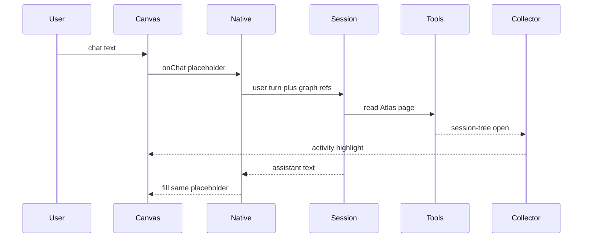

# Plan: deploy SHA and session chat

**work_id:** `2026-09-10-deploy-sha-and-session-chat`  
**change-class:** `new-surface`  
**path:** design (stops for approval; do not implement)

## Problem

Two user-facing gaps after v0.3.0:

1. The build badge shows `SHA unavailable` when Cartograph is deployed.
2. The canvas Chat control does not talk to the Copilot session that opened
   the canvas. It runs local keyword search (`answerQuery`) and canvas-server
   page reads, which are excluded from activity. That is not useful.

## Intent + scope

Make a deployed Cartograph show the **runtime's own source SHA**, and make
canvas Chat a **user turn on the same host session**, so the agent reads
Atlas pages with ordinary session tools and those reads light the graph.

In scope:

- Discover why the published/installed artifact still lacks `cartographBuild`
  even though `scripts/package-apm.mjs` stamps and asserts it for the release
  archive consumer.
- Carry stamped identity through every supported deploy path (release
  archive, marketplace/APM install, user-scope plugin). Keep Git inspect
  only for a source checkout at `.apm/extensions/cartograph`.
- Replace native `onChat: answerQuery` with a join-existing-session send.
  Include compact graph refs (open Atlas ids, selected node, query), not
  page bodies.
- Keep HTTP/dev servers without a host session on local `answerQuery`,
  labeled as local search.
- Preserve per-request chat placeholders, canvas request validation, and
  the viewer-PID exclusion for canvas-server I/O.
- Update usage/architecture docs.

## Non-goals

- Borrowing the consumer repository SHA when a stamp is missing.
- Creating a new Copilot SDK session (`createSession`) or a second agent.
- Auto-starting collectors, privileged workloads, or treating decorative
  pulses as reads.
- Sending full Markdown bodies in the chat envelope.
- Replacing toolbar search with chat.
- Authoring agent-spec Gherkin in this repository.

## Pinned decisions

1. **Stamp, do not guess.** `SHA unavailable` stays the honest label when
   metadata is missing. Fix publication/install so deployed runtimes include
   `cartographBuild` (or a sibling stamp file APM cannot strip). Do not
   inspect Git outside a source checkout. Grounded by
   `decisions/cartograph-v030-interaction-contract.md` and
   `test/build-info.test.mjs`.
2. **Join the opening session only.** Native chat uses the host `session`
   already bound to the canvas. Probe the real Copilot SDK send/complete
   API at implement time. Reject `createSession` and any other session id.
3. **Session tools own graph reads.** Canvas chat must not call
   `loadPageFromRoots` / `answerQuery` on the native path. Page reads happen
   in the session process tree so the collector can observe them. Canvas
   server PID remains excluded (`docs/file-access.md`).
4. **Compact context envelope.** The session turn carries Atlas ids, selected
   node id/path, current query, and a short instruction to read pages via
   tools. No full bodies. Prefix the turn so it is visible in the transcript
   (for example `Cartograph chat:`).
5. **Placeholder identity stays.** Completions update only their own pending
   graph message (`AGENTS.md`, `test/server-ui.test.mjs`).
6. **Local search is fallback only.** `answerQuery` remains for non-native
   HTTP/dev. UI must not present it as a session reply.
7. **One work_id.** SHA packaging and session chat ship together; they are
   both user-visible deploy/session contracts.

## Challenge summary

| Counter | Source | Severity | Pin |
|---------|--------|----------|-----|
| Git inspect in deployments labels the consumer commit | `decisions/cartograph-v030-interaction-contract.md`; `test/build-info.test.mjs` | high | Accept: stamp only |
| `createSession` / extra CopilotClient would not be the underlying session | Copilot SDK session docs; canvas already joins `ctx.session` | high | Accept: join existing session |
| Canvas-server page reads never become activity | `docs/file-access.md` | high | Accept: session-tree reads |
| Canvas chat can hijack an in-flight coding turn | canvas/session bidirectional model | medium | Accept with transcript prefix; user asked for this |
| Streaming replies can overwrite another pending chat | `test/server-ui.test.mjs` | high | Accept: keep placeholder pairing |
| Local `answerQuery` is still useful without a host | current `atlas/chat.mjs` | low | Modify: fallback only |

C1 non-trivial counters present. C2 high-severity pinned, none rejected
without rationale. C3 pins visible. C4 scope intact. C5 no implementation
in this path.

## Genesis Artifacts

### Intent

Deployed Cartograph must identify its source commit. Canvas Chat must drive
the host session to read Atlas pages, lighting the graph from real access.

### Scope / non-goals

See sections above.

### Component diagram



Existing: UI, HTTP, Native, Local search, collector. New surface: host-session
send and a stamp that survives install.

### Sequence



### Interface sketch

- `readBuildInfo(runtime)` unchanged. Deployed `package.json` (or sibling
  stamp included in the APM file set) MUST contain valid `cartographBuild`.
  Packaging and marketplace install tests assert `readBuildInfo(deployed).commit`
  is the source SHA.
- Native `onChat(text, state)`:
  - inputs: user text, selected id, atlas ids/paths, query
  - action: send on the **existing** host session; wait for that turn's
    assistant completion
  - output: `{ text, hits? }` updating the same pending chat row
  - failure: placeholder becomes an error; do not swap in `answerQuery`
- Non-native `onChat` omitted → current `answerQuery`.
- No new canvas action required for v1; Chat stays a UI POST.

### Composition

| Box | Mode | Rationale |
|-----|------|-----------|
| Build stamp | INLINE | Already `cartographBuild` on runtime package.json |
| Session chat bridge | INLINE in `extension.mjs` | Host SDK only; no extra package |
| Local search | INLINE existing `atlas/chat.mjs` | Fallback / tests |
| Collector | existing | No new provider |

Declared targets: Copilot canvas host only. No new external modules.

### Cost note

Stance `balanced`. One extra host-session turn per canvas message. Envelope is
small (ids/paths). No in-canvas model. Do not paste page bodies (that would
inflate prefix and duplicate reads). Cap is none declared.

### Acceptance

1. APM-installed / marketplace / user-scope Cartograph shows the source SHA
   (first eight characters; hover full). Source checkouts still use Git.
   Missing stamp still shows `SHA unavailable`, never the consumer SHA.
2. Native canvas Chat sends a user turn to the opening session. The agent
   reads at least one mounted Atlas page with session tools. That read can
   appear as activity. Canvas-server chat reads do not.
3. Completions attach to their own placeholder under concurrency.
4. HTTP/dev without a session still uses local search and does not claim
   "session".
5. Docs describe stamp vs Git vs unavailable, and Chat vs toolbar search.

### Stop for approval

This path does not implement. Wait for explicit approval of this pinned plan.

## Catalogue Review

`catalogue_review: n/a` — product canvas/runtime contract, not skill topology,
gate map, fan-out, or pattern-catalogue injection. B17 is used only for this
Autogenesis Run's own Enter card.

## Behavioural contract (agent-spec)

`deferred: agent-spec skill is not installed in this harness; Node tests own
the behavioural contract.` `@forbidden` / `@critical` coverage is expressed as
the deterministic smokes below, not Gherkin.

## Evaluation plan

Deterministic (primary):

- `test/build-info.test.mjs`: source Git, deployed no-borrow, stamp priority,
  invalid stamp fails.
- `scripts/package-apm.mjs` consumer: installed runtime `readBuildInfo`
  equals source; bootstrap `build` matches. Extend if marketplace/user-scope
  install drops the stamp.
- Native chat tests: `onChat` is not `answerQuery`; a fake host session
  records one send with graph refs; reply fills the originating placeholder.
- Activity tests: session-tree page open highlights; canvas-server
  `loadPageFromRoots` during local search does not.
- Existing concurrent chat placeholder tests remain green.

Agent evaluations (secondary): optional live host smoke after implement; not
sole evidence.

## Adversarial scenario draft

```yaml
id: session-chat-and-build-sha-adversarial-v1
adversarial: true
work_id: 2026-09-10-deploy-sha-and-session-chat
packages: [atlas-cartograph]
filename: references/scenarios/session-chat-and-build-sha-adversarial-v1.yaml
smokes:
  - id: no-consumer-sha
    source: decisions/cartograph-v030-interaction-contract.md
    expect: deployed unstamped runtime commit is null, not consumer HEAD
  - id: stamp-survives-install
    source: scripts/package-apm.mjs consumer assertion
    expect: installed runtime readBuildInfo.commit equals source SHA
  - id: join-not-create-session
    source: Copilot SDK session model
    expect: native onChat uses canvas host session id; no createSession
  - id: session-reads-not-canvas-reads
    source: docs/file-access.md
    expect: native chat does not loadPageFromRoots; session-tree reads may highlight
  - id: placeholder-pairing
    source: test/server-ui.test.mjs
    expect: each completion updates only its pending graph message
expect:
  all_smokes_green: true
```

Implement may add smokes; it must not drop these without a new design.

## Todos (after approval)

1. Trace marketplace / user-scope install and keep the stamp in the shipped
   file set.
2. Wire native `onChat` to the existing host session; keep local fallback.
3. Prove SHA, session-join, read-path, and placeholder tests.
4. Update `docs/usage.md` and `docs/architecture.md`.
